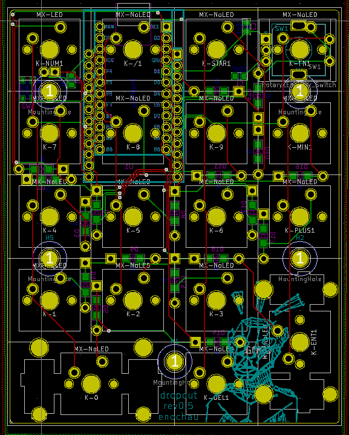
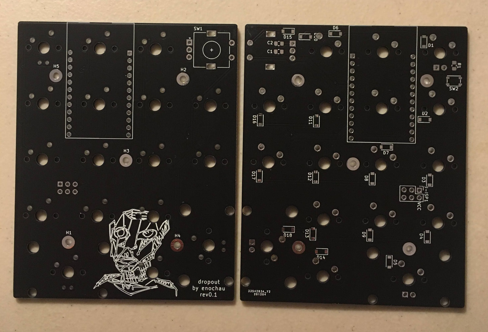

# Dropout 
### (mechanical numpad w/ roatry encoder)

## Firmware
Dropout uses [QMK](https://github.com/qmk/qmk_firmware).
For now you'll have to use my fork of QMK under [the dropout-numpad branch](https://github.com/ec965/qmk_firmware/tree/dropout-numpad/keyboards/dropout).
If you know what you're doing, you can also copy the firmware files from this repository into your local QMK repository and compile it that way.

## Parts

### Case Parts
Amount | Part | Dimensions
--- | --- | ---
5 | M2 F-F standoffs | minimum: 13mm (mini usb) or 11mm (micro-usb)
10 | M2 screws | 5mm
4 | rubber bumpon feet

Sandwhich! case (parts in this order from top down)
*  Plate
*  PCB
*  Base

### PCB Components
Amount | Part | Package
--- | --- | ---
17 | diodes (1n4148 recommended) | SOD-123 (SMD) or DO-35 (THT)
1 | resistor (333 Ohms) | 0805
2 | capacitors (10nF) | 0805
1 | led | 1.8mm
1 | rotary encoder | EC-11
1 | push button | SPST PTS810
1 | pro-micro | usb-mini or usb-micro
16 | mx-switches | 
2 | 2U stabilizers | 

#### Notes
* Encoder can be swapped for a 1u switch.
  - If opting for the 1u switch, capacitors are not needed.
* If using encoder, capacitors can be omitted but resulting encoder signal will not be as smooth.
* Resistor can be omitted if num-lock led is not used.

## Build Guide

* The bottom of the PCB is the side without the stencil art of the person.
* The top of the PCB is the side with the stencil art person on it.

1. Start on the bottom of the PCB. Solder on all the diodes. Make sure that the diodes are in the correct direction. The diagram below should match up to the the symbol on the schematic and the physical diodes.

2. Solder on capacitors C1 and C2. These are located near the rotary encoder.

3. Solder on the resistor R1. It is near the num lock key. This resistor is to limit the current going to the num-lock led.

4. Solder on the SPST reset switch.

5. Solder on the Pro Micro header pins with the short side down. DO NOT solder on the Pro Micro.

6. Solder on the rotary encoder.

7. Flip the board over to the top side. You should now see the stencil art of the the person. Put two 2U stablizers on the board for the Zero and Enter keys.
    1. If you are using Kailh Box switches, solder on the num-lock LED before putting the switch on the board.
    2. If you are using regular Cherry, Gateron, etc. you can wait to solder the num-lock LED after all the switches are soldered on.

8. Put the switches on the plate. Line up the plate with the pcb and push the two parts together. There may be some friction but as long as none of the switch pins get bent it is okay.

9. Flip the PCB over to the bottom side. As you solder on the switches, apply some pressure to push the plate into the PCB to ensure that the switches are flush with the PCB.

10. Tape the Pro Micro onto the header pins. 
Clip the long header pins to be flush with the holes on the Pro Micro.
Then, solder the Pro Micro to the header pins.

11. Put the standoffs through the holes on the top of the plate and screw them in.

12. Get the bottom plate and screw the other end of the standoffs into the bottom plate. The standoffs should go through the holes in the PCB.

13. Place rubber feet onto the bottom of the numpad.

## PCBs

* rev 0.5

* rev 0.1

## License

Hardware designs are under the MIT license. QMK is under the GPL v2 license therefore, the firmware is also under the GPLv2 license.